# Skylearn.py 

## Overview:

Creating a web-based data-mining application for preprocessing, visualization and classification of data. The web app is based on ‘WEKA’ (Waikato Environment for Knowledge Analysis) , a very popular data-mining tool used for data pre-processing, classification, regression, clustering, association rules, and visualization.   
A user can upload a dataset (.csv or .json). The dataset is first put through preprocessing. He/she can view the dataset, the description of the dataset, attributes (columns) of the dataset, etc. The user can also choose to drop some columns. The user also has a choice to clean the dataset, fill ‘NA’ values.

The next feature is classification. For the web application, the ‘Linear Classification Family’, ‘Support Vector Classification Family’, ‘Tree Family’ and ‘Kernel Estimation Family’ of machine learning models were chosen.

The <b>Linear Classification Family</b> contains the following models:

<ul>
  <li>Logistic Regression (Binary Classification)</li>
  <li>Naïve Bayes Classifier</li>
</ul>

The <b>Support Vector Classification Family</b> consists of the following model:

<ul>
  <li>Linear Support Vector Classifier</li>
</ul>

The <b>Tree Family</b> consists of the following models:

<ul>
  <li>Decision Tree Classifier</li>
  <li>Random Forest Classifier (Ensemble)</li>
</ul>

The <b>Kernel Estimation Family</b> consists of the following model:

<ul><li>K - Nearest Neighbours Classifier</li></ul>

The user can choose from any of the above classifications models provided. The user can
Choose the way in which testing is needed to be done. For example, if a test data is to be provided, the dataset is to be split into a certain size for training and testing or if cross- validation is to be performed. He/she can then choose to perform scaling using the Standard Scaler or encoding using the Label Encoder provided by the Sci-kit Learn Library. The user can then go ahead with classification. After classification is performed, the user can then review the performance of the classification model on the basis of various metrics provided such as the Classification Report, Confusion Matrix and Accuracy Score.

The next feature is visualization of data. Two basic plots are provided to the user. The first is the pair plot which provides the complete feature relation between each attribute of the dataset. The second one is the column-relation visualization where the user can choose the X and the Y from the columns (features) of the uploaded dataset to see a relation between them.

## Requirements:

The following are the requirements of the project:

<ul>
  <li>Flask</li>
  <li>NumPy</li>
  <li>Pandas</li>
  <li>Sklearn</li>
  <li>Matplotlib</li>
  <li>Seaborn</li>
  <li>JavaScript</li>
  <li>Missingno</li>
  <li>HTML</li>
  <li>CSS</li>
  <li>JQuery</li>
  <li>Charts.JS</li>
</ul>

## Flow Diagram:

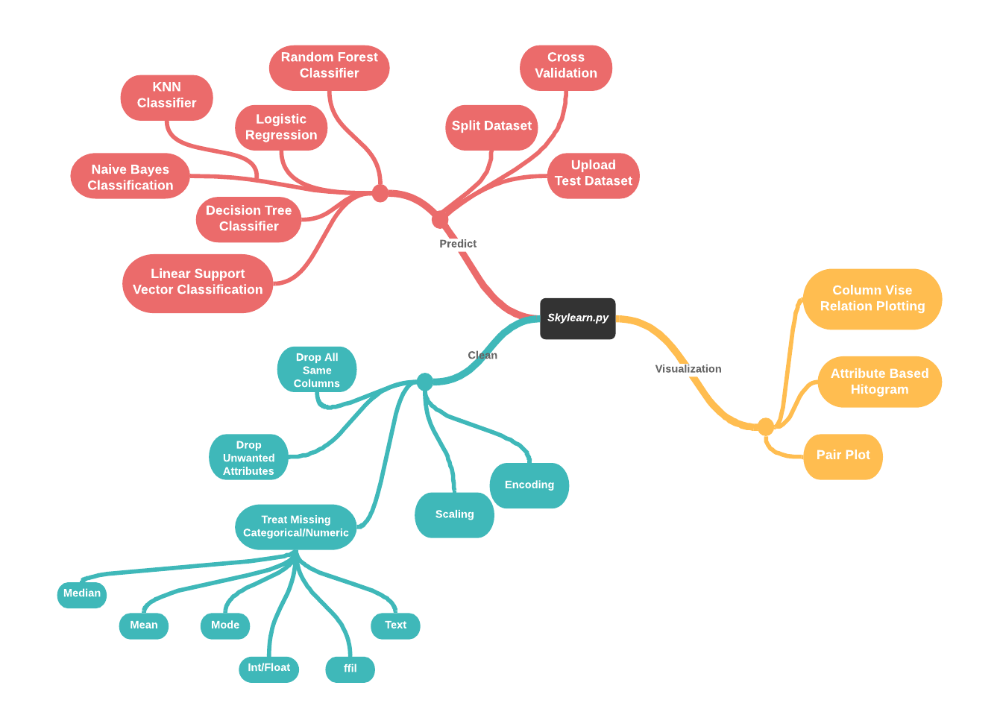

## Outputs:

1. Home/Preprocess (  when no dataset is uploaded or on Clear  )  
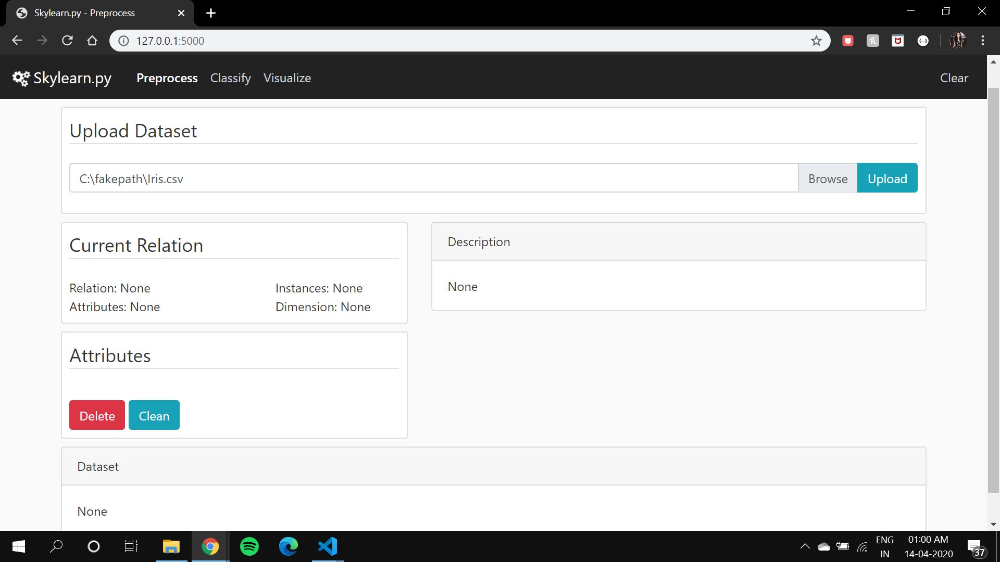

2. Home/Preprocess : Upload (  On Uploading .csv/.json/.xls  )  
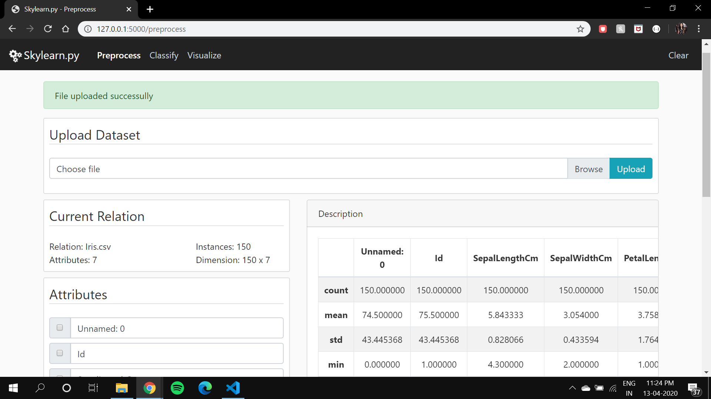

3. Home/Preprocess : Histogram of Selected Column ( Attribute PetalLengthCm )  
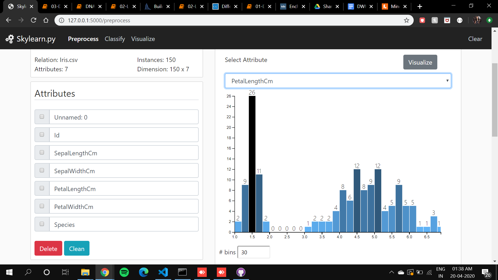

4. Home/Preprocess : Delete ( Deleting Unwanted Attributes )  
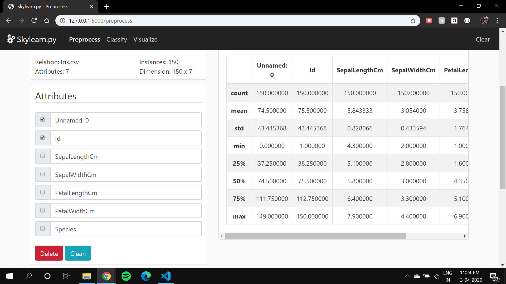

5. Home/Preprocess : View Data ( On any deletion/cleaning of data viewing newly cleant data )  
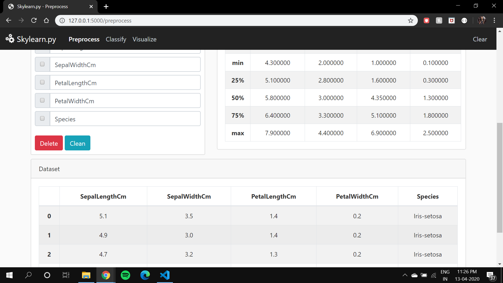

6. Home/Preprocess : Clean Missing (Replace Missing Data with Mean/Median/Mode/FFill/Int/Float )  
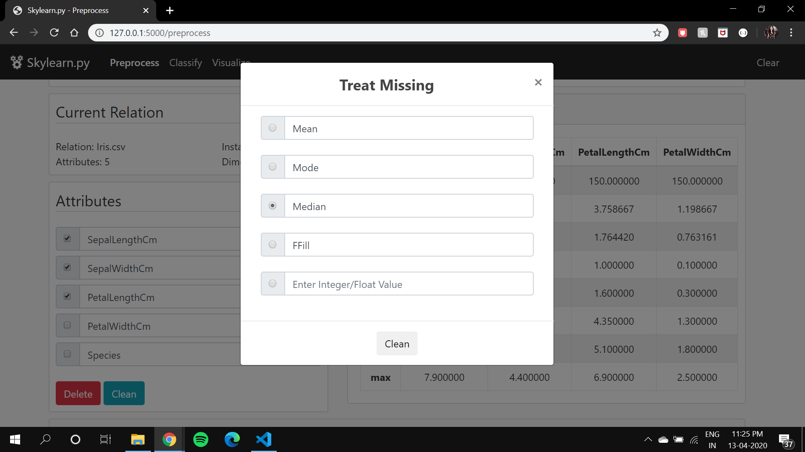

7. Home/Preprocess : Data Cleaning Done  
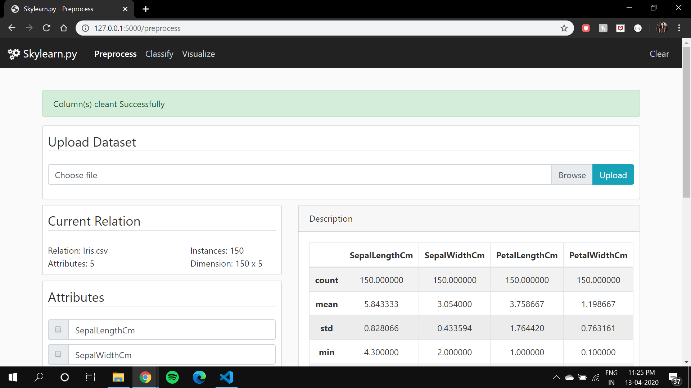

8. Classify : Linear-SV Classifier Report ( K-Fold Cross Validation + Scaling )  
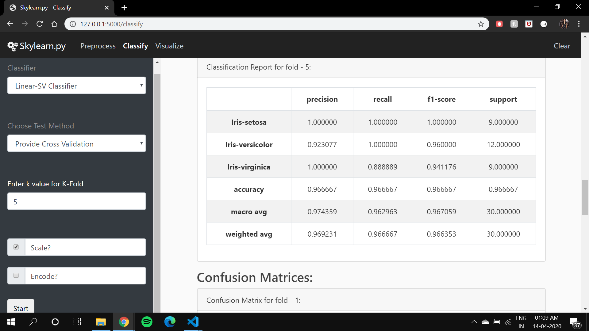

9. Classify : Naive-Bayes Classifier Accuracy Report ( Train-Test Split )  
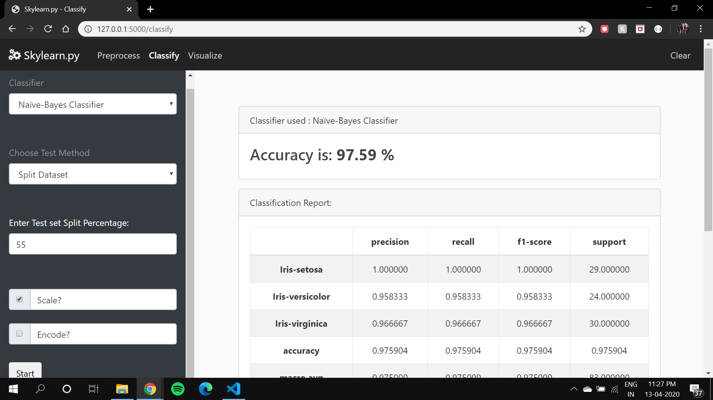

10. Classify : Decision Classification Report (On Kyphosis Dataset )  
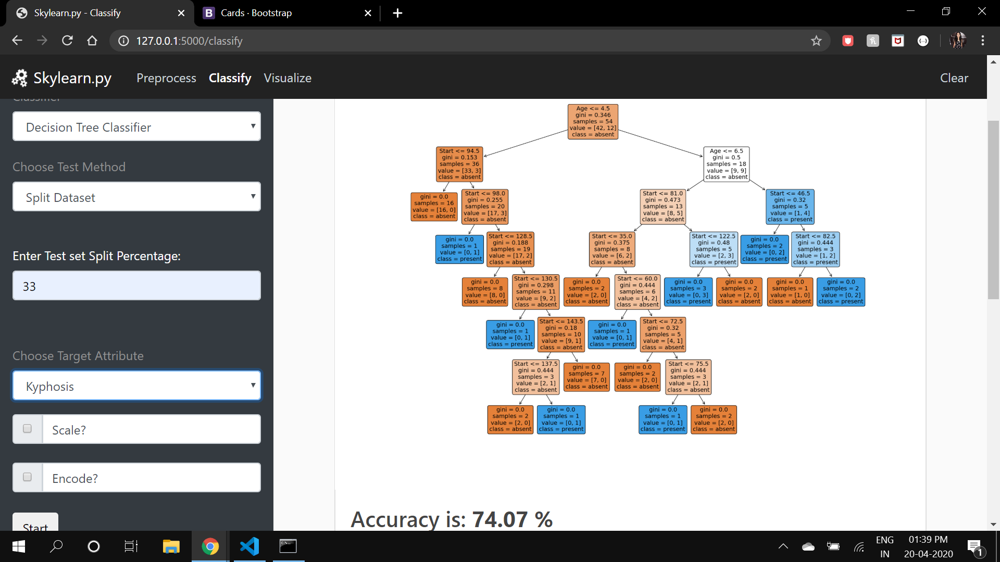

11. Classify : Random Forest Classification Report (On Kyphosis Dataset )  
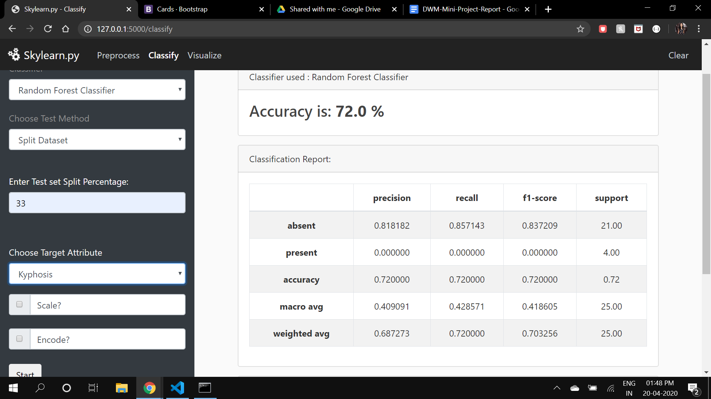

12. Classify : Logistic Classification Confusion Matrix ( Uploading Test Dataset )  
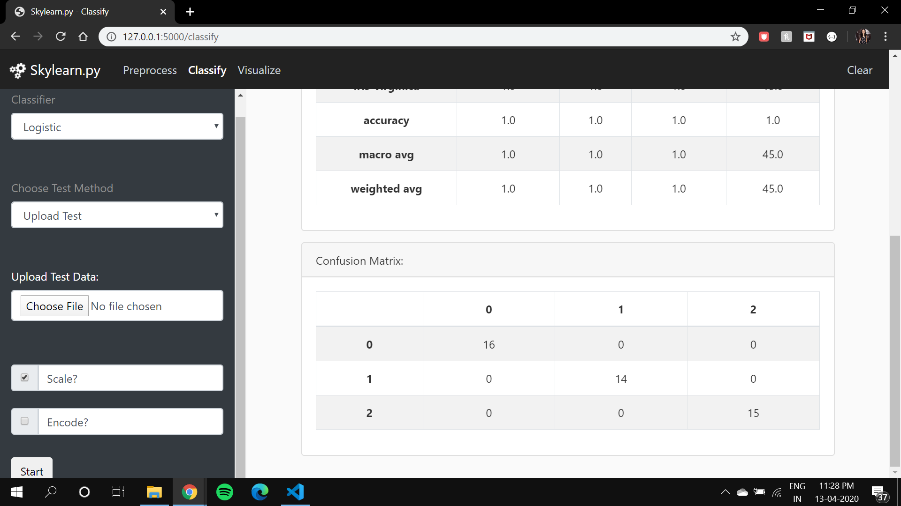

13. Visualization : Pair-Plot and Column-Relation Visualization  
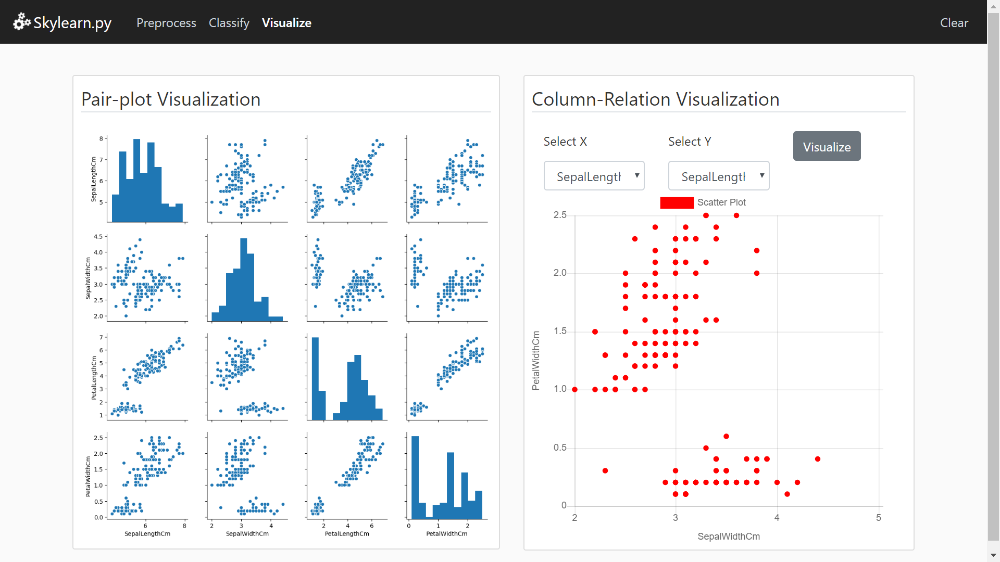

14. Visualize : Column-Relation Visualization ( Selecting X - Y Attributes to Visualize )  
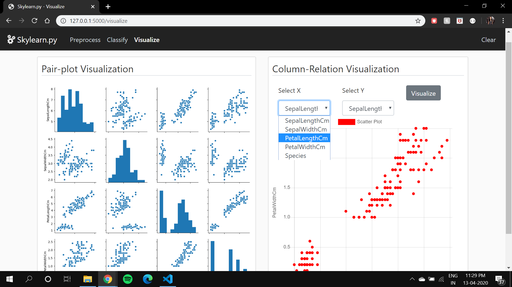

## Contributors

Made with 💙 &nbsp;by <a href="https://github.com/Darlene-Naz">Darlene Nazareth</a> and <a href="https://github.com/sherwyn11">Sherwyn D'souza</a></b>.

## License

[MIT License Link](https://github.com/sherwyn11/Skylearn.py/blob/master/LICENSE)

© 2020 Copyright

